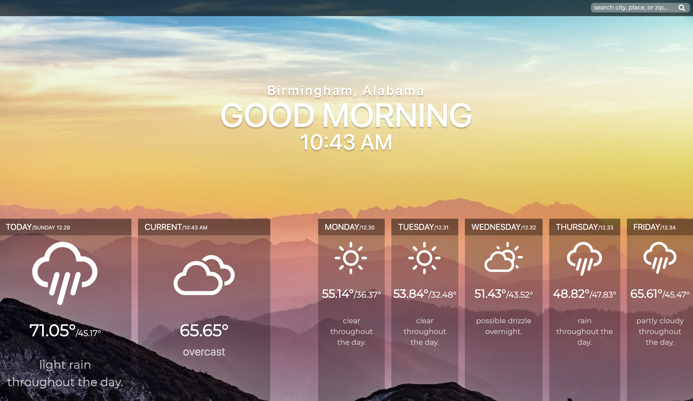

### Summary

### Technologies Used

### Screenshots

### Running the Application

This project was bootstrapped with [Create React App](https://github.com/facebook/create-react-app).   
Navigate to the `src` folder and run `npm start` which runs the app in development mode.  
Open [http://localhost:3000](http://localhost:3000) to view it in the browser.  
The page will reload if you make edits. 
You will also see any lint errors in the console.

### Current To-Do List:
<ul>
  <li>Implement Reverse Geocoding to Dynamically Output Current User Location</li>
  <li>Implement Form to Allow User to Search Other Location Weather</li>
  <li>Implement Autocomplete Location Search</li>
  <li>Fix the Forecasted Day Issue</li>
</ul>

### Eventual Improvements List:
<ul>
  <li>Improve UX Regarding Weather Cards</li>
  <li>Implement the Ability to Add "Favorite" Locations</li>
  <li>Expand Output Weather Images and Improve Summaries</li>
</ul>
